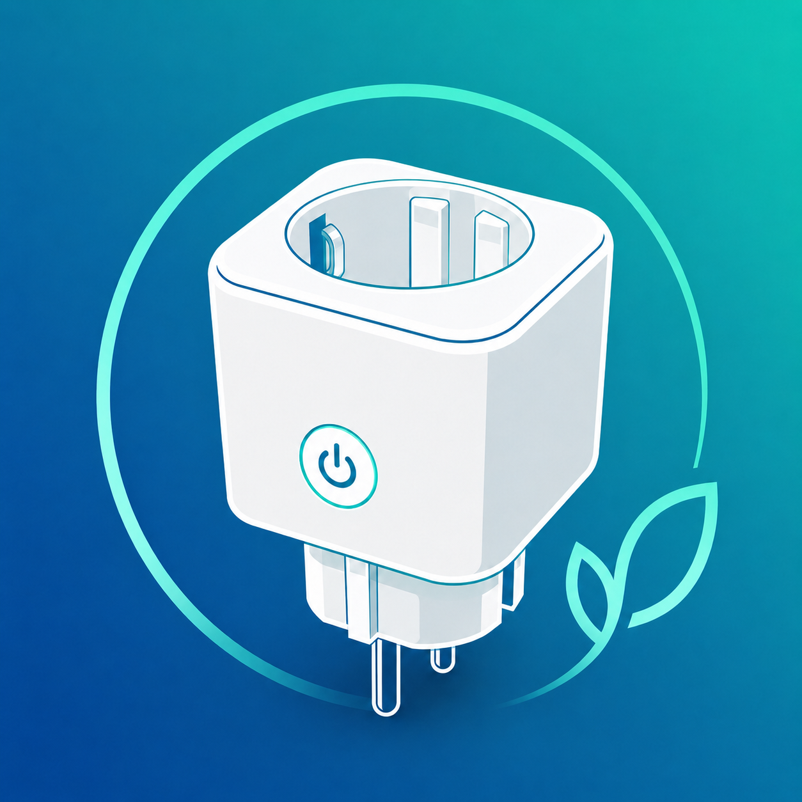

# SAJ Elekeeper Smart Plug

An unofficial Home Assistant custom integration for SAJ Elekeeper Smart Plugs.
It provides switch control and power/energy measurements through SAJ's private
Elekeeper cloud API.

> [!WARNING]
> This project uses an undocumented private API. SAJ can change or disable it at
> any time. This integration is not affiliated with, endorsed by, or supported
> by SAJ.

## Features

- One Home Assistant switch for each Elekeeper Smart Plug
- Current power, voltage, current, device status, and daily/monthly/lifetime
  energy sensors
- Login with a **username or email address**
- Portal selection for Europe, China, and other countries/regions
- Configurable whole-minute update interval from 1 to 1,440 minutes
- Corrected switch-state handling based on Elekeeper's `deviceSwitch` value

The integration intentionally creates no entities for inverters, batteries,
wallboxes, or plant-level values.

## Installation

### HACS

1. Open **HACS → Integrations** in Home Assistant.
2. Open the menu, choose **Custom repositories**, and add
   `https://github.com/M-Rapske/SAJ-Elekeeper-Smart-Plug` as an **Integration**.
3. Search for **SAJ Elekeeper Smart Plug** and install it.
4. Restart Home Assistant.

### Manual

1. Copy `custom_components/saj_elekeeper_smart_plug` into your Home Assistant
   configuration directory at
   `/config/custom_components/saj_elekeeper_smart_plug`.
2. Restart Home Assistant.

## Migration from version 0.x

Version 1.0 changes the integration domain from `saj_elekeeper` to
`saj_elekeeper_smart_plug`. Remove the old integration in Home Assistant, copy
the new folder, restart Home Assistant, and add **SAJ Elekeeper Smart Plug**
again. Home Assistant creates new entity IDs because the domain has changed.

## Configuration

1. Go to **Settings → Devices & services → Add integration**.
2. Select **SAJ Elekeeper Smart Plug**.
3. Select the portal region where your account was created.
4. Enter your username or email address and password.
5. Select the plant when your account has more than one.

To change the update interval later, open **Settings → Devices & services → SAJ
Elekeeper Smart Plug → Configure**. The API is polled because no usable Smart
Plug push endpoint is currently available.

## Portal regions

| Region | Portal |
| --- | --- |
| Europe | `https://eop.saj-electric.com` |
| China | `https://op.saj-electric.cn` |
| Other countries/regions | `https://iop.saj-electric.com` |

Existing configurations without a saved region continue to use the European
portal for backwards compatibility.

## Requirements

Home Assistant installs the required dependency automatically:
[`pysaj-elekeeper`](https://github.com/giovadroid/pysaj-elekeeper).

Local brand images are included in
`custom_components/saj_elekeeper_smart_plug/brand/`.
They are displayed by Home Assistant 2026.3 and newer.

## Translations

The integration includes full UI translations for English, German, French,
Spanish, Italian, Dutch, Portuguese (Brazil and Portugal), Polish, Czech,
Russian, Ukrainian, Turkish, Simplified and Traditional Chinese, Japanese, and
Korean. Home Assistant falls back to English for other interface languages.

## Security and support

Credentials are stored only in Home Assistant's configuration storage. Never
share passwords, bearer tokens, or complete API responses in issues.

For bugs and feature requests, please use the
[GitHub issue tracker](https://github.com/M-Rapske/SAJ-Elekeeper-Smart-Plug/issues).

## License

This project is licensed under the [MIT License](LICENSE.md).
